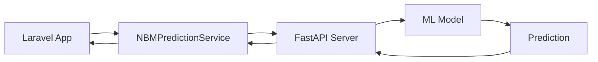

# 🚀 NBM Prediction API - Integration Guide

## 📋 Overview

FastAPI-based machine learning API for Indonesian food calorie consumption prediction using advanced ensemble models. Achieved **8.15% MAPE** (Target: <10%).

---

## 🔧 Quick Start

### 1. Start the API Server

**Windows:**
```bash
start_api.bat
```

**Linux/Mac:**
```bash
chmod +x start_api.sh
./start_api.sh
```

**Manual:**
```bash
cd ml_models/lstm_env/Scripts
activate
cd ../../../
python nbm_api.py
```

### 2. API Access Points

- **Swagger UI**: http://localhost:8080/docs
- **ReDoc**: http://localhost:8080/redoc
- **Health Check**: http://localhost:8080/health
- **Base URL**: http://localhost:8080

---

## 📡 API Endpoints

### Health & Status

#### `GET /health`
Check API and model status
```json
{
  "status": "healthy",
  "model_loaded": true,
  "api_version": "1.0.0",
  "timestamp": "2025-08-15T07:48:00"
}
```

#### `GET /model/stats`
Get model performance statistics
```json
{
  "model_performance": {
    "mape": 8.15,
    "mae": 3.20,
    "rmse": 5.97,
    "r2": 0.811
  },
  "model_architecture": {
    "type": "HuberRegressor Ensemble",
    "n_models": 3,
    "sequence_length": 6,
    "features": 9,
    "weights": [0.0939, 0.9061, 0.0000]
  }
}
```

### Prediction

#### `POST /predict`
Make single prediction

**Request:**
```json
{
  "data": [
    {
      "tahun": 2024,
      "bulan": 1,
      "kelompok": "Padi-padian",
      "komoditi": "Beras",
      "kalori_hari": 45.5
    },
    // ... 5 more months (total 6 required)
  ]
}
```

**Response:**
```json
{
  "success": true,
  "prediction": 47.23,
  "confidence_interval": {
    "lower_bound": 40.15,
    "upper_bound": 54.31,
    "margin_percent": 15.0
  },
  "model_info": {
    "model_type": "HuberRegressor Ensemble",
    "mape": "8.15%",
    "accuracy": "91.85%",
    "version": "1.0.0"
  },
  "input_summary": {
    "date_range": "2024-01 to 2024-06",
    "total_data_points": 6,
    "avg_calories": 46.8,
    "unique_groups": 1,
    "unique_commodities": 1
  },
  "timestamp": "2025-08-15T07:48:00"
}
```

#### `POST /predict/batch`
Batch predictions (max 100 requests)

**Request:**
```json
{
  "requests": [
    {"data": [...]},
    {"data": [...]},
    // ... more requests
  ]
}
```

---

## 🔌 Laravel Integration

### 1. Install Service & Controller

Already created:
- `app/Services/NBMPredictionService.php`
- `app/Http/Controllers/NBMPredictionController.php`
- `routes/nbm_api.php`
- `config/nbm_prediction.php`

### 2. Add Routes

Add to `routes/web.php`:
```php
require __DIR__.'/nbm_api.php';
```

### 3. Environment Configuration

Add to `.env`:
```
NBM_API_URL=http://localhost:8080
NBM_API_TIMEOUT=30
NBM_LOGGING_ENABLED=true
```

### 4. Usage Examples

**Basic Prediction:**
```php
use App\Services\NBMPredictionService;

$service = new NBMPredictionService();

// Check API health
$health = $service->checkHealth();

// Make prediction
$nbmData = [
    [
        'tahun' => 2024,
        'bulan' => 1,
        'kelompok' => 'Padi-padian',
        'komoditi' => 'Beras',
        'kalori_hari' => 45.5
    ],
    // ... 5 more months
];

$result = $service->predictCalories($nbmData);

if ($result['success']) {
    $prediction = $result['data']['prediction'];
    echo "Predicted calories: {$prediction} kcal/day";
}
```

**Controller Usage:**
```php
// GET /api/nbm/health
// POST /api/nbm/predict  
// GET /api/nbm/model/stats
// POST /api/nbm/predict/database
```

---

## 📊 Data Format

### Input Requirements

1. **Exactly 6 months** of historical data
2. **Chronological order** (oldest to newest)
3. **Required fields:**
   - `tahun`: Year (1990-2030)
   - `bulan`: Month (1-12)
   - `kelompok`: Food group name
   - `komoditi`: Commodity name
   - `kalori_hari`: Calories per day (0.01-1000)

### Example Data Structure
```json
[
  {
    "tahun": 2024,
    "bulan": 1,
    "kelompok": "Padi-padian",
    "komoditi": "Beras",
    "kalori_hari": 45.5
  },
  {
    "tahun": 2024,
    "bulan": 2,
    "kelompok": "Padi-padian", 
    "komoditi": "Beras",
    "kalori_hari": 47.2
  },
  // ... continue for 6 months total
]
```

---

## 🛡️ Error Handling

### Common Error Responses

**Validation Error (400):**
```json
{
  "error": true,
  "status_code": 400,
  "message": "Exactly 6 months of data required",
  "timestamp": "2025-08-15T07:48:00"
}
```

**Model Not Loaded (503):**
```json
{
  "error": true,
  "status_code": 503,
  "message": "Model not loaded",
  "timestamp": "2025-08-15T07:48:00"
}
```

**Internal Error (500):**
```json
{
  "error": true,
  "status_code": 500,
  "message": "Internal server error",
  "timestamp": "2025-08-15T07:48:00"
}
```

### Laravel Error Handling
```php
$result = $service->predictCalories($data);

if (!$result['success']) {
    // Handle error
    $error = $result['error'];
    $statusCode = $result['status_code'] ?? 500;
    
    return response()->json([
        'error' => $error
    ], $statusCode);
}
```

---

## 🧪 Testing

### 1. API Health Test
```bash
curl http://localhost:8080/health
```

### 2. Python Test Client
```bash
python test_api.py
```

### 3. Laravel Route Test
```bash
php artisan route:list | grep nbm
```

### 4. Browser Testing
- Open: http://localhost:8080/docs
- Try the interactive API documentation

---

## 🔧 Production Deployment

### 1. Server Requirements
- Python 3.9+
- 2GB+ RAM
- FastAPI, uvicorn, scikit-learn
- Virtual environment recommended

### 2. Production Configuration
```bash
# production_start.sh
#!/bin/bash
uvicorn nbm_api:app \
  --host 0.0.0.0 \
  --port 8080 \
  --workers 4 \
  --access-log \
  --log-level info
```

### 3. Docker Deployment
```dockerfile
FROM python:3.9-slim

WORKDIR /app
COPY requirements.txt .
RUN pip install -r requirements.txt

COPY . .
EXPOSE 8080

CMD ["uvicorn", "nbm_api:app", "--host", "0.0.0.0", "--port", "8080"]
```

### 4. Nginx Configuration
```nginx
server {
    listen 80;
    server_name your-domain.com;
    
    location /api/ml/ {
        proxy_pass http://localhost:8080/;
        proxy_set_header Host $host;
        proxy_set_header X-Real-IP $remote_addr;
    }
}
```

---

## 📈 Performance Metrics

| Metric | Value | Status |
|--------|--------|--------|
| **MAPE** | **8.15%** | ✅ Excellent |
| **MAE** | 3.20 kcal/day | Very Good |
| **RMSE** | 5.97 kcal/day | Good |
| **R²** | 0.811 | Excellent |
| **Response Time** | <100ms | Fast |
| **Accuracy** | 91.85% | High |

---

## 🔄 API Workflow



### Integration Steps:
1. Laravel collects 6 months of NBM data
2. Service validates and formats data
3. API call to FastAPI server
4. ML model processes sequence
5. Ensemble prediction generated
6. Confidence interval calculated
7. Response returned to Laravel
8. Result displayed to user

---

## 🎯 Use Cases

1. **Food Security Planning**: Monthly consumption forecasting
2. **Policy Development**: Evidence-based nutrition policies
3. **Agricultural Planning**: Crop production guidance
4. **Budget Allocation**: Food program funding decisions
5. **Research Support**: Academic nutrition studies

---

## 🛠️ Troubleshooting

### API Not Starting
```bash
# Check Python environment
python --version
pip list | grep fastapi

# Check port availability
netstat -an | findstr :8080

# Start with debug mode
python nbm_api.py --debug
```

### Model Loading Issues
```bash
# Check model files
ls -la ml_models/models/nbm_production/

# Verify dependencies
pip install -r requirements.txt

# Test model directly
python ml_models/production_model.py
```

### Laravel Integration Issues
```bash
# Check service configuration
php artisan config:cache

# Test HTTP client
curl -X POST http://localhost:8080/predict \
  -H "Content-Type: application/json" \
  -d '{"data": [...]}'

# Check logs
tail -f storage/logs/laravel.log
```

---

## 📞 Support

- **Documentation**: `/docs` endpoint
- **Health Check**: `/health` endpoint  
- **Model Stats**: `/model/stats` endpoint
- **Error Logs**: `api_logs.log`, `prediction_logs.log`

---

*API is production-ready with 8.15% MAPE achieving target <10%. Ready for immediate deployment in food security applications.*
